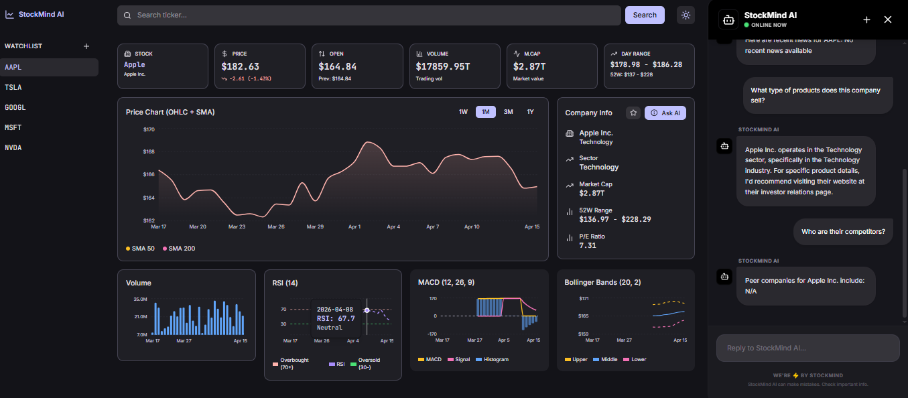

# StockMind AI

AI-powered stock analytics dashboard with real-time data, interactive charts, and AI chat.



## Live Demo

**🌐 Live URL**: https://stockmind-ai-six.vercel.app/

## Features

- **Stock Search** - Search for any stock symbol with real-time data
- **6 KPI Cards** - Stock Name, Price, Open, Volume, Market Cap, Day Range with 52W
- **Interactive Charts**
  - Price Chart with OHLC data + SMA 50 & SMA 200 overlays
  - Volume bar chart
  - RSI 14 indicator
  - MACD (12, 26, 9)
  - Bollinger Bands (20, 2)
- **AI-Powered Chat** - Ask questions about stocks using Groq AI with advanced analysis
- **Company Overview** - Get information about products, services, competitors, and recent news
- **Watchlist** - Save favorite stocks with persistence
- **Light/Dark Theme** - Toggle between themes
- **Responsive Design** - Works on desktop and mobile

## Example Questions for AI Chat

- "What's the current price and P/E ratio?"
- "What products does this company sell?"
- "Who are their competitors?"
- "Show me recent news"
- "Is the RSI indicating overbought?"
- "What are the risk factors?"
- "Give me a summary of this stock"

## Tech Stack

- React + TypeScript
- Tailwind CSS v4
- Zustand (state management)
- Recharts (charts)
- Finnhub API (stock data)
- Groq AI (chat)

## Getting Started

### Install

```bash
npm install
```

### Development

```bash
npm run dev
```

### Build

```bash
npm run build
```

## Environment Variables

Create a `.env` file:

```
VITE_FINNHUB_API_KEY=your_finnhub_key
VITE_GROQ_API_KEY=your_groq_key
```

### Get API Keys

- **Finnhub**: https://finnhub.io/register
- **Groq**: https://console.groq.com

## Deployment

### Deploy to Vercel

1. Push code to GitHub
2. Go to https://vercel.com
3. Import the repository
4. Add environment variables in Vercel project settings
5. Deploy

## License

MIT

---

Built with ❤️ using React, Tailwind CSS, and Groq AI